.boxed{background-color: lightblue; width: 200px; padding: 25px;}

<!--- ---------------------------------------------------------------------------------------- ---->
<!--- ---------------------------------------------------------------------------------------- ---->

<h2> &emsp;&emsp;&emsp;&emsp;&emsp;&emsp;&emsp;&emsp;&emsp;&emsp;&emsp;&emsp;&emsp;&ensp; O2A: One-shot Observational learning with Action vectors </h2>

<h3><b>Journal</b> </h3>

L. Pauly, W. C. Agboh, D. C. Hogg, and R. Fuentes, "O2A: One-shot Observational
learning with Action vectors", at Frontiers in Robotics and AI, Vol.8, pp.239, 2021. 
<a href="https://www.frontiersin.org/articles/10.3389/frobt.2021.686368/full"> [paper]</a>
<a href="https://docs.google.com/presentation/d/1pMMhYbRxoYhzjQuysP6tOBuzaTrlubu1/edit?usp=sharing&ouid=101733491474689445191&rtpof=true&sd=true"> [slides]</a>
  
<h3><b>Workshops</b> </h3>
"One-shot observation learning", at IROS Workshop: Examining Sensing Modalities
for Robust and Dexterous manipulation, IROS, 2018.  
"One-shot observation learning using visual activity features", at 3rd UK robotics
manipulation workshop, 2019.  
"One-shot observational learning", at AI @ Leeds workshop, 2019  
 
 
 

<h3><b>I. Overview: </b> </h3>

 
We present O2A, a novel method for learning to perform robotic manipulation tasks from a single (one-shot) third-person demonstration. To our knowledge, it is the first time this has been done for a single demonstration. The key novelty lies in pre-training a feature extractor for creating a perceptual representation for actions called <i>'action vectors'</i>. We pre-train a 3D-CNN action vector extractor as an action classifier on a generic action dataset.  The action vectors from the observed third-person demonstration and trial robot executions are used to generate rewards for reinforcement learning of the demonstrated task. We report on experiment in simulation and on a real robot, with changes in viewpoint of observation, properties of the objects involved, scene background and morphology of the manipulator between the demonstration and the learning domains. O2A outperforms the baseline approaches under different domain shifts and has comparable performance with Oracle. 

<h3><b>II. Dataset </b> </h3>

The Leeds Manipulation Dataset (LMD) can be downloaded from <a href="https://leeds365-my.sharepoint.com/:f:/g/personal/cnlp_leeds_ac_uk/EnSNo3ut5d9DhTbHWWE2760Bz99Y5AaxXlNXOlkJGoMopQ?e=KNQk5p">here</a>.

<h3><b>III. Results: </b> </h3>

We present the performance of O2A in the robotic experiments. Video clips of the demonstration and execution of correspoding learned optimal policy (for simulation experiment) or optimal sequence obtained (for real robot experiment) are given below. Results are shown for action vectors extracted from pool5 layer of NN:UCF101 model. 

<!--- ---------------------------------------------------------------------------------------- ---->
<!--- ---------------------------------------------------------------------------------------- ----

<h4><b>Abstract: </b> </h4>

Observation learning is the process of learning a task by observing an expert demonstrator. Our principal contribution is a one-shot learning method for robot manipulation tasks in which only a single demonstration is required. The key idea is to encode the demonstration in an activity space defined by a previously trained activity classifier. The distance between this encoding and equivalent encodings from trials of a robot performing the same task provides a reward function supporting iterative learning of task completion by the robotic manipulator. We use reinforcement learning for experiments with a simulated robotic manipulator, and stochastic trajectory optimisation for experiments with a real robotic manipulator.
We show that the proposed method can be used to learn tasks from a single demonstration under varying conditions of viewpoints, object properties, morphology of manipulators and scene backgrounds.<a href="https://arxiv.org/abs/1810.07483"> [view paper] </a>

<!--- ---------------------------------------------------------------------------------------- ---->
<!--- ---------------------------------------------------------------------------------------- ----

<h4><b>Overview: </b> </h4>

<video width="512" height="320" controls autoplay loop>
  <source src="./../Humanoids_Video.mp4" type="video/mp4">
  Your browser does not support the video tag.
</video>

<!--- ---------------------------------------------------------------------------------------- ---->
<!--- ---------------------------------------------------------------------------------------- ---->

<h4><b> Reaching a target (Simulation)</b> </h4>
<table style="display:inline-block; border:10px; !important">

  <tr style="border-bottom: none;padding:25px; border-width:0px; margin:0px;  !important;">
    <th> &emsp;&emsp;&emsp; </th>
    <th> &emsp; </th>
    <th style="text-align:center">Demonstration</th>
    <th style="text-align:center">Optimal policy   execution - V1</th>
    <th style="text-align:center">Optimal policy   execution - Obj1</th>
    <th style="text-align:center">Optimal policy   execution - BG</th>
  </tr>

  <tr>
    <th> &emsp;&emsp;&emsp; </th>
    <th> &emsp; </th>
    <td style="border-bottom: none;padding:25px; border-width:0px; margin:0px;  !important;" align="center"><figure>
     

     <figcaption>
     </figcaption>
    </figure></td>

    <td style="border-bottom: none;padding:25px; border-width:0px; margin:0px;  !important;" align="center"><figure>
     
     <figcaption>
     </figcaption>
    </figure></td>

    <td style="border-bottom: none;padding:25px; border-width:0px; margin:0px;  !important;" align="center"><figure>
     
     <figcaption>
     </figcaption>
    </figure></td>

    <td style="border-bottom: none;padding:25px; border-width:0px; margin:0px;  !important;" align="center"><figure>
     
     <figcaption>
     </figcaption>
    </figure></td>
  </tr>

  <tr style="border-bottom: none;padding:25px; border-width:0px; margin:0px;  !important;">
    <th> &emsp;&emsp;&emsp; </th>
    <th style="text-align:center">Demonstration</th>
    <th style="text-align:center">Optimal policy   execution- V2</th>
    <th style="text-align:center">Optimal policy   execution - Obj2</th>
    <th> &emsp; </th>

    <th style="text-align:center">Demonstration</th>
    <th style="text-align:center">Optimal policy   execution- M</th>
  </tr>

  <tr>
    <th> &emsp;&emsp;&emsp; </th>
    <td style="border-bottom: none;padding:25px; border-width:0px; margin:0px;  !important;" align="center"><figure>
     
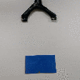

     <figcaption>
     </figcaption>
    </figure></td>

    <td style="border-bottom: none;padding:25px; border-width:0px; margin:0px;  !important;" align="center"><figure>
     
     <figcaption>
     </figcaption>
    </figure></td>

    <td style="border-bottom: none;padding:25px; border-width:0px; margin:0px;  !important;" align="center"><figure>
     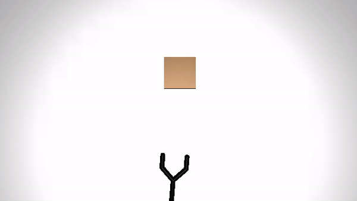
     <figcaption>
     </figcaption>
    </figure></td>

     <th> &emsp; </th>

    <td style="border-bottom: none;padding:25px; border-width:0px; margin:0px;  !important;" align="center"><figure>
     

     <figcaption>

     </figcaption>
    </figure></td>
    <td style="border-bottom: none;padding:25px; border-width:0px; margin:0px;  !important;" align="center"><figure>
     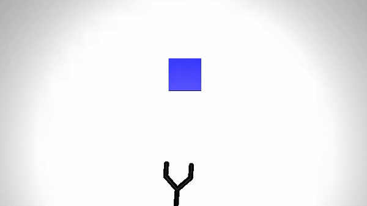
     <figcaption>

     </figcaption>
    </figure></td>
  </tr>
</table>

<!--- ---------------------------------------------------------------------------------------- ---->
<h4><b> Pushing an object (Simulation)</b> </h4>
<table style="display:inline-block; border:10px; !important">

  <tr style="border-bottom: none;padding:25px; border-width:0px; margin:0px;  !important;">
    <th> &emsp;&emsp;&emsp; </th>
    <th> &emsp;</th>
    <th style="text-align:center">Demonstration</th>
    <th style="text-align:center">Optimal policy   execution - V1</th>
    <th style="text-align:center">Optimal policy   execution - Obj1</th>

    <th style="text-align:center">Optimal policy   execution - BG</th>
  </tr>

  <tr>
    <th> &emsp;&emsp;&emsp; </th>
    <th> &emsp;</th>
    <td style="border-bottom: none;padding:25px; border-width:0px; margin:0px;  !important;" align="center"><figure>
     

     <figcaption>
     </figcaption>
    </figure></td>

    <td style="border-bottom: none;padding:25px; border-width:0px; margin:0px;  !important;" align="center"><figure>
     
     <figcaption>
     </figcaption>
    </figure></td>

    <td style="border-bottom: none;padding:25px; border-width:0px; margin:0px;  !important;" align="center"><figure>
     
     <figcaption>
     </figcaption>
    </figure></td>

    <td style="border-bottom: none;padding:25px; border-width:0px; margin:0px;  !important;" align="center"><figure>
     
     <figcaption>
     </figcaption>
    </figure></td>
  </tr>

  <tr style="border-bottom: none;padding:25px; border-width:0px; margin:0px;  !important;">
    <th> &emsp;&emsp;&emsp; </th>
    <th style="text-align:center">Demonstration</th>
    <th style="text-align:center">Optimal policy   execution- V2</th>
    <th style="text-align:center">Optimal policy   execution - Obj2</th>
    <th> &emsp; </th>
    <th style="text-align:center">Demonstration</th>
    <th style="text-align:center">Optimal policy   execution- M</th>
  </tr>

  <tr>
    <th> &emsp;&emsp;&emsp; </th>
    <td style="border-bottom: none;padding:25px; border-width:0px; margin:0px;  !important;" align="center"><figure>
     

     <figcaption>
     </figcaption>
    </figure></td>

    <td style="border-bottom: none;padding:25px; border-width:0px; margin:0px;  !important;" align="center"><figure>
     
     <figcaption>
     </figcaption>
    </figure></td>

    <td style="border-bottom: none;padding:25px; border-width:0px; margin:0px;  !important;" align="center"><figure>
     
     <figcaption>
     </figcaption>
    </figure></td>

     <th> &emsp; </th>

    <td style="border-bottom: none;padding:25px; border-width:0px; margin:0px;  !important;" align="center"><figure>
     

     <figcaption>
     </figcaption>
    </figure></td>

    <td style="border-bottom: none;padding:25px; border-width:0px; margin:0px;  !important;" align="center"><figure>
     
     <figcaption>
     </figcaption>
    </figure></td>
  </tr>
</table>

<!--- ---------------------------------------------------------------------------------------- ---->

<h4><b> Pushing an object (real robot) </b> </h4>
<table style="display:inline-block; border:10px; !important">

  <tr style="border-bottom: none;padding:25px; border-width:0px; margin:0px;  !important;">
    <th> &emsp;&emsp;&emsp; </th>
    <th> &emsp; </th>
    <th style="text-align:center">Demonstration</th>
    <th style="text-align:center">Optimal sequence   execution - V1</th>
    <th style="text-align:center">Optimal sequence   execution - Obj1</th>
    <th style="text-align:center">Optimal sequence   execution - BG</th>
  </tr>

  <tr>
    <th> &emsp;&emsp;&emsp; </th>
    <th> &emsp; </th>
    <td style="border-bottom: none;padding:25px; border-width:0px; margin:0px;  !important;" align="center"><figure>
     

     <figcaption>
     </figcaption>
    </figure></td>

    <td style="border-bottom: none;padding:25px; border-width:0px; margin:0px;  !important;" align="center"><figure>
     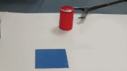
     <figcaption>
     </figcaption>
    </figure></td>

    <td style="border-bottom: none;padding:25px; border-width:0px; margin:0px;  !important;" align="center"><figure>
     
     <figcaption>
     </figcaption>
    </figure></td>

    <td style="border-bottom: none;padding:25px; border-width:0px; margin:0px;  !important;" align="center"><figure>
     
     <figcaption>
     </figcaption>
    </figure></td>
  </tr>

  <tr style="border-bottom: none;padding:25px; border-width:0px; margin:0px;  !important;">
    <th> &emsp;&emsp;&emsp; </th>
    <th style="text-align:center">Demonstration</th>
    <th style="text-align:center">Optimal sequence   execution- V2</th>
    <th style="text-align:center">Optimal sequence   execution - Obj2</th>
    <th> &emsp; </th>

    <th style="text-align:center">Demonstration</th>
    <th style="text-align:center">Optimal sequence   execution- M</th>
  </tr>

  <tr>
    <th> &emsp;&emsp;&emsp; </th>
    <td style="border-bottom: none;padding:25px; border-width:0px; margin:0px;  !important;" align="center"><figure>
     

     <figcaption>

     </figcaption>
    </figure></td>
    <td style="border-bottom: none;padding:25px; border-width:0px; margin:0px;  !important;" align="center"><figure>
     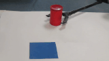
     <figcaption>
     </figcaption>
    </figure></td>

    <td style="border-bottom: none;padding:25px; border-width:0px; margin:0px;  !important;" align="center"><figure>
     
     <figcaption>
     </figcaption>
    </figure></td>

     <th> &emsp; </th>

    <td style="border-bottom: none;padding:25px; border-width:0px; margin:0px;  !important;" align="center"><figure>
     

     <figcaption>

     </figcaption>
    </figure></td>
    <td style="border-bottom: none;padding:25px; border-width:0px; margin:0px;  !important;" align="center"><figure>
     
     <figcaption>

     </figcaption>
    </figure></td>
  </tr>
</table>

<!--- ---------------------------------------------------------------------------------------- ---->

<h4><b> Hammering (real robot) </b> </h4>
<table style="display:inline-block; border:10px; !important">

  <tr style="border-bottom: none;padding:25px; border-width:0px; margin:0px;  !important;">
    <th> &emsp;&emsp;&emsp; </th>
    <th style="text-align:center">Demonstration</th>
    <th style="text-align:center">Optimal sequence   execution - V1</th>
    <th style="text-align:center">Optimal sequence   execution - Obj1</th>
    <th style="text-align:center">Optimal sequence   execution - Obj2</th>
    <th style="text-align:center">Optimal sequence   execution- M</th>
    <th style="text-align:center">Optimal sequence   execution - BG</th>
  </tr>

  <tr>
    <th> &emsp;&emsp;&emsp; </th>
    <td style="border-bottom: none;padding:25px; border-width:0px; margin:0px;  !important;" align="center"><figure>
     
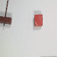

     <figcaption>
     </figcaption>
    </figure></td>

    <td style="border-bottom: none;padding:25px; border-width:0px; margin:0px;  !important;" align="center"><figure>
     
     <figcaption>
     </figcaption>
    </figure></td>

    <td style="border-bottom: none;padding:25px; border-width:0px; margin:0px;  !important;" align="center"><figure>
     
     <figcaption>
     </figcaption>
    </figure></td>

    <td style="border-bottom: none;padding:25px; border-width:0px; margin:0px;  !important;" align="center"><figure>
     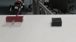
     <figcaption>
     </figcaption>
    </figure></td>

    <td style="border-bottom: none;padding:25px; border-width:0px; margin:0px;  !important;" align="center"><figure>
     
     <figcaption>
     </figcaption>
    </figure></td>

    <td style="border-bottom: none;padding:25px; border-width:0px; margin:0px;  !important;" align="center"><figure>
     
     <figcaption>
     </figcaption>
    </figure></td>

  </tr>

  <tr style="border-bottom: none;padding:25px; border-width:0px; margin:0px;  !important;">
    <th> &emsp;&emsp;&emsp; </th>
    <th> &emsp; </th>
    <th> &emsp; </th>
    <th style="text-align:center">Demonstration</th>
    <th style="text-align:center">Optimal sequence   execution- V2</th>

  </tr>

  <tr>
    <th> &emsp;&emsp;&emsp; </th>
    <th> &emsp; </th>
    <th> &emsp; </th>

    <td style="border-bottom: none;padding:25px; border-width:0px; margin:0px;  !important;" align="center"><figure>
     

     <figcaption>
     </figcaption>
    </figure></td>
    <td style="border-bottom: none;padding:25px; border-width:0px; margin:0px;  !important;" align="center"><figure>
     
     <figcaption>
     </figcaption>
    </figure></td>

     <th> &emsp; </th>

  </tr>
</table>

<!--- ---------------------------------------------------------------------------------------- ---->

<h4><b> Sweeping (real robot) </b> </h4>
<table style="display:inline-block; border:10px; !important">

  <tr style="border-bottom: none;padding:25px; border-width:0px; margin:0px;  !important;">
    <th> &emsp;&emsp;&emsp; </th>
    <th> &emsp;&emsp;&emsp; </th>
    <th> &emsp;&emsp;&emsp; </th>

    <th style="text-align:center">Demonstration</th>
    <th style="text-align:center">Optimal sequence   execution - V1</th>
    <th style="text-align:center">Optimal sequence   execution - BG</th>
    <th> &emsp;&emsp;&emsp; </th>
    <th style="text-align:center">Demonstration</th>
    <th style="text-align:center">Optimal sequence   execution- V2</th>
  </tr>

  <tr>
    <th> &emsp;&emsp;&emsp; </th>
    <th> &emsp;&emsp;&emsp; </th>
    <th> &emsp;&emsp;&emsp; </th>
    <td style="border-bottom: none;padding:25px; border-width:0px; margin:0px;  !important;" align="center"><figure>
     

     <figcaption>
     </figcaption>
    </figure></td>

    <td style="border-bottom: none;padding:25px; border-width:0px; margin:0px;  !important;" align="center"><figure>
     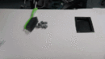
     <figcaption>
     </figcaption>
    </figure></td>

    <td style="border-bottom: none;padding:25px; border-width:0px; margin:0px;  !important;" align="center"><figure>
     
     <figcaption>
     </figcaption>
    </figure></td>
    <th> &emsp;&emsp;&emsp; </th>
    <td style="border-bottom: none;padding:25px; border-width:0px; margin:0px;  !important;" align="center"><figure>
     
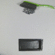

     <figcaption>
     </figcaption>
    </figure></td>

    <td style="border-bottom: none;padding:25px; border-width:0px; margin:0px;  !important;" align="center"><figure>
     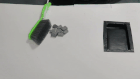
     <figcaption>
     </figcaption>
    </figure></td>
  </tr>
</table>

<!--- ---------------------------------------------------------------------------------------- ---->

<h4><b> Striking (real robot) </b> </h4>
<table style="display:inline-block; border:10px; !important">

  <tr style="border-bottom: none;padding:25px; border-width:0px; margin:0px;  !important;">
    <th> &emsp;&emsp;&emsp; </th>
    <th> &emsp;&emsp;&emsp; </th>
    <th> &emsp;&emsp;&emsp; </th>

    <th style="text-align:center">Demonstration</th>
    <th style="text-align:center">Optimal sequence   execution - V1</th>
    <th style="text-align:center">Optimal sequence   execution - BG</th>
    <th> &emsp;&emsp;&emsp; </th>
    <th style="text-align:center">Demonstration</th>
    <th style="text-align:center">Optimal sequence   execution- V2</th>
  </tr>

  <tr>
    <th> &emsp;&emsp;&emsp; </th>
    <th> &emsp;&emsp;&emsp; </th>
    <th> &emsp;&emsp;&emsp; </th>
    <td style="border-bottom: none;padding:25px; border-width:0px; margin:0px;  !important;" align="center"><figure>
     

     <figcaption>
     </figcaption>
    </figure></td>

    <td style="border-bottom: none;padding:25px; border-width:0px; margin:0px;  !important;" align="center"><figure>
     
     <figcaption>
     </figcaption>
    </figure></td>

    <td style="border-bottom: none;padding:25px; border-width:0px; margin:0px;  !important;" align="center"><figure>
     
     <figcaption>
     </figcaption>
    </figure></td>

    <th> &emsp;&emsp;&emsp; </th>

    <td style="border-bottom: none;padding:25px; border-width:0px; margin:0px;  !important;" align="center"><figure>
     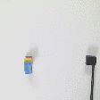
     <figcaption>
     </figcaption>
    </figure></td>

    <td style="border-bottom: none;padding:25px; border-width:0px; margin:0px;  !important;" align="center"><figure>
     
     <figcaption>
     </figcaption>
    </figure></td>

  </tr>

</table>

<!--- ---------------------------------------------------------------------------------------- ---->
<!--- ---------------------------------------------------------------------------------------- ---->
